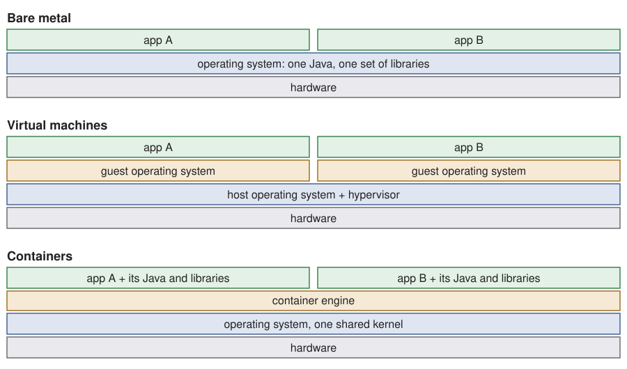
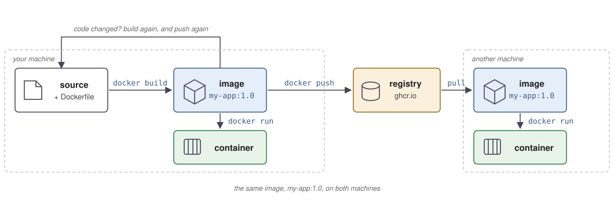

[Slides for this chapter](../slides/05-docker.qmd)

## Objectives

By the end of this chapter, you should be able to:

- Explain the difference between bare metal, virtualization and
  containerization.
- Explain what an image, a container and a registry are.
- Write a `Dockerfile` that packages an application, and build an image
  from it.
- Publish an image to a registry, and run it on another machine.
- Run several containers together with Docker Compose, with volumes and
  a network.

## The problem containers solve

Your CLI from [practical work 1](../practical-work/pw1.qmd) runs on your
machine because you installed Java 25 and Maven, in the right versions.
The next application needs Java 17. A third one needs a database in
version 14, while another needs the same database in version 16. Install
everything on the same machine and the versions collide. On top of that,
each application starts in its own way: `./mvnw package` then
`java -jar app.jar` for one, `pip install` then `python app.py` for
another, a shell script for a third. Whoever runs them has to know all
of it. This is why "it works on my machine" is not a deployment plan.

## Three ways to run software

{fig-alt="Bare metal, virtual machines and containers compared: applications on the operating system, applications each in a guest OS, applications in containers over one shared kernel."}

**Bare metal**: the software is installed directly on the machine, and
uses its operating system and its resources. This is the fastest, and
the least isolated: every application has to live with the versions
installed on that machine, so two applications that need different
versions of Java, of a library or of a database are in conflict.

**Virtualization**: the software runs in a **virtual machine**, a
complete computer simulated by the host, with its own operating system.
Isolation is excellent, but each virtual machine boots a full operating
system, which costs memory, disk and startup time.

**Containerization**: the software runs in a **container**, isolated
from the rest of the machine, but **sharing the kernel** of the host
operating system. A container holds the application, its Java, its
libraries and its tools, but not a second operating system. It weighs a few tens of megabytes
for a small image, a few hundreds for one that carries a Java runtime,
against gigabytes for the disk of a virtual machine. And it starts in a
fraction of a second: on the laptop that wrote this chapter, an nginx
container answers its first request 0.2 seconds after `docker run`.

A server is just a computer, and "the cloud" is just someone else's
computer. Containers are how applications are shipped to those computers
today.

## What a container is

A **container** holds an application **and everything it needs to run**:
the right version of Java, the right libraries, the right tools, all
isolated from the rest of the machine. What goes
into it is described in one file, the **Dockerfile**: a repeatable build
description that lives with your code, so everyone builds the same
environment, without following a page of manual instructions.

Containers give you three things:

- **One recipe**: the Dockerfile says how to build the image, and what
  a container started from it runs by default.
- **One artefact**: each version of the application is one image, built
  once and identical on every machine.
- **One interface**: the same commands build, start, stop and inspect
  any application, whatever its language.

```sh
docker build    # build the image
docker run      # start a container from it
docker stop     # stop that container
docker logs     # read what it printed
```

You do not need the tools of an application to run it, and with a
multi-stage build (see *Go further*), not even to build it.

In [practical work 2](../practical-work/pw2.qmd) you will ship a network
server this way, and in the rest of the course you will meet containers
whenever a service has to run somewhere else.

## Install Docker

::: {.panel-tabset}

### Linux and WSL

Install [Docker Engine](https://docs.docker.com/engine/install/) from
the repository of your distribution, not Docker Desktop:
[Ubuntu](https://docs.docker.com/engine/install/ubuntu/),
[Debian](https://docs.docker.com/engine/install/debian/),
[Fedora](https://docs.docker.com/engine/install/fedora/),
[others](https://docs.docker.com/engine/install/).

Then follow the
[post-installation steps](https://docs.docker.com/engine/install/linux-postinstall/):
"Manage Docker as a non-root user", so you do not have to type `sudo`
before every command, and "Configure Docker to start on boot".

### macOS

Install [Docker Desktop](https://docs.docker.com/desktop/). It runs
Docker inside a virtual machine, and starts it when you open the
application.

:::

Check the installation:

```sh
docker --version
docker compose version
```

If a command answers "Cannot connect to the Docker daemon", the
background service is not running: start Docker Desktop, or start the
service on Linux.

## Code examples

The examples of this chapter are in the
[code examples repository](), directory
`05-docker`. Clone it once, or `git pull` if you already have it:

```sh
git clone .git
cd dai-code-examples/05-docker
```

Each example has its own README. Run them when the text points to them.

## Images, containers and registries

Three words, defined by the [OCI](https://opencontainers.org/), the
standard that Docker and its competitors implement:

- An **image** is a read-only package: an application, its dependencies,
  and the instructions to start it. An image is built once and never
  changes.
- A **container** is an instance of an image, running or stopped,
  isolated from the host and from the other containers. From one image you can start as
  many containers as you want.
- A **registry** stores images, so that other machines can download
  them. [Docker Hub](https://hub.docker.com) is the default one. In this
  course we use the
  [GitHub Container Registry](https://docs.github.com/en/packages/working-with-a-github-packages-registry/working-with-the-container-registry)
  (`ghcr.io`), so your images sit next to your code.

The relation between the first two is the one you know from
object-oriented programming: the **image is the class** and the
**container is the object**. `docker run` plays the role of `new`: from
one image you create as many containers as you want, each with its own
state, and deleting a container leaves the image untouched.

## The lifecycle

{fig-alt="Source code and Dockerfile, docker build produces an image, docker push sends it to a registry, docker pull brings it to another machine, docker run creates a container."}

1. You write your application and a `Dockerfile` next to it.
2. `docker build` packages them into an **image**, on your machine.
3. `docker push` sends the image to a **registry**.
4. Anyone can `docker pull` it, on any machine with Docker.
5. `docker run` creates a **container** from the image and starts it.

::: {.callout-important}
An image is a **frozen build**. Changing your source code does not
change the image, and it does not change the containers already running.
After every change you have to build again, and push again if others use
your image. Forgetting this is the most common Docker mistake.
:::

## Docker

Docker has two parts:

- the **daemon**, a background service that builds images and runs
  containers.
- the **client**, the `docker` command you type, which sends orders to
  the daemon.

{fig-alt="The Docker client, the Docker host with its daemon, containers and images, and the registry."}

On Linux the daemon runs directly on your machine. On macOS and Windows
it runs inside a virtual machine, which Docker Desktop manages for you.

Run your first container:

```sh
docker run hello-world
```

Docker does not find the image on your machine, pulls it from Docker
Hub, creates a container and starts it. The output tells that story.

You can also run a full distribution:

```sh
docker run --rm -it ubuntu:26.04 /bin/bash
```

- `--rm` deletes the container when it exits.
- `-it` connects your terminal to it.
- `/bin/bash` replaces the default command of the image.

Inside, you can install packages and change files as on any Linux
machine. Everything you change is lost when the container stops, because
the container is gone and the image never changed. Type `exit` to
leave.

## The Dockerfile

A `Dockerfile` describes how to build an image, one instruction per
line. The instructions you need:

| Instruction | What it does |
|-------------|--------------|
| `FROM` | the base image to start from |
| `WORKDIR` | the working directory for the instructions that follow |
| `RUN` | run a command **while building** the image |
| `COPY` | copy files from your project into the image |
| `ENTRYPOINT` | the program to start when the container starts |
| `CMD` | the default arguments, or the default command |
| `ARG` | a value given at build time |
| `ENV` | an environment variable, for the rest of the build and in the container |

Build an image from the directory that holds the `Dockerfile`, then run
a container from it:

```sh
docker build -t my-image .
docker run --rm my-image
```

`-t my-image` gives the image a name, and the `.` is the **build
context**: the directory Docker sends to the daemon, and the only place
`COPY` can take files from.

::: {.callout-important title="ENTRYPOINT and CMD"}
This pair confuses everyone, and it is a classic exam question.
`ENTRYPOINT` says **what** the container runs, `CMD` gives the
**default arguments**. What you write after `docker run my-image`
replaces `CMD`, not `ENTRYPOINT`.

```dockerfile
ENTRYPOINT ["java", "-jar", "app.jar"]
CMD ["--help"]
```

`docker run my-image` runs `java -jar app.jar --help`, and
`docker run my-image --loop` runs `java -jar app.jar --loop`. With only
a `CMD`, the whole command is replaced instead:
`docker run my-image echo hello` just prints `hello`.

Rule of thumb: when the container **is one application**, use
`ENTRYPOINT` for the program and `CMD` for its default arguments. When
it is **a box with tools**, use `CMD` alone, so anything can be run in
it.

`ENTRYPOINT` itself can be replaced when you need a shell in an image
that starts an application:

```sh
docker run --rm -it --entrypoint sh my-image
```
:::

Examples [`01` to `05`](/tree/main/05-docker):
the smallest image, `CMD`, `ENTRYPOINT` with `CMD`, `RUN` and `COPY`,
and build arguments. Run them in order.

::: {.callout-tip collapse="true" title="Docker cheat sheet"}
```sh
docker build -t <image> .          # build an image from the current directory
docker run <image>                 # start a container
docker run -d <image>              # ... in the background
docker run --rm -it <image> sh     # ... with a shell, removed on exit
docker ps                          # running containers
docker ps -a                       # ... including the stopped ones
docker logs <container>            # what the container printed
docker stop <container>            # stop it
docker exec -it <container> sh     # a shell inside a running container
docker images                      # images on your machine
docker container prune             # delete stopped containers
docker image prune                 # delete dangling images (-a: all unused)
```
:::

## Layers

An image is not one block. It is a stack of **layers**, and the
`Dockerfile` builds them one instruction at a time.

{fig-alt="A Dockerfile on the left, one arrow per instruction, the image layers on the right with their size."}

`docker history` lists the layers of an image, the newest first:

```sh
docker history my-image
```

```
CREATED BY                                      SIZE
ENTRYPOINT ["cat" "app.txt"]                    0B
RUN /bin/sh -c mkdir /data # buildkit           8.19kB
COPY app.txt . # buildkit                       12.3kB
WORKDIR /app                                    8.19kB
CMD ["/bin/sh"]                                 0B
ADD alpine-minirootfs-3.24.2-aarch64.tar.gz …   9.31MB
```

The bottom two lines come from the base image, the others from the
`Dockerfile`. `ENTRYPOINT` weighs nothing, `RUN` and `COPY` weigh what
they wrote.

Docker keeps the layers it has already built, so a second build only
redoes what changed.

### Images share their layers

A layer belongs to no image in particular: it is stored once, and every
image that uses it points at it.

{fig-alt="Several containers sharing the layers of one image, each with its own thin read-write layer."}

Two images built on the same base share that base. `docker system df -v`
shows it: the two images below weigh 13.5 MB each, but 9.3 MB of that is
the same Alpine base, counted once.

```
REPOSITORY    SIZE      SHARED SIZE   UNIQUE SIZE
layer-demo2   13.5MB    9.314MB       4.204MB
layer-demo    13.5MB    9.314MB       4.221MB
```

The same happens when you pull: Docker downloads only the layers it does
not have yet, and prints `Already exists` for the others.

### The container's thin writable layer

The layers of an image are **read-only**. When you start a container,
Docker adds one thin **read-write** layer on top, and only that layer
belongs to the container.

{fig-alt="The read-only image layers with a padlock, and the thin read-write container layer above them."}

Everything the container writes goes there. A file it modifies is first
copied up into that layer, and the image below never changes - which is
why ten containers of the same image cost almost nothing, why the image
is identical everywhere, and why **what a container writes dies with
it**. To keep data, you need a volume.

## Volumes and bind mounts

A container that writes a file writes it inside itself, and the file
disappears with the container. A **volume** connects a directory of your
machine to a directory of the container, so the data survives, and so
the container can read your files:

```sh
docker run --rm -v "$(pwd):/data" alpine:3.24 sh -c 'date > /data/date.txt'
cat date.txt
```

The container writes `/data/date.txt`, and the file appears in your
current directory. It works the other way round too: the container reads
the files you put there. This is how you give files to a container, and
how you keep what it produces.

What we just used is a **bind mount**: a directory of your machine,
mounted in the container. Docker also manages storage for you, under the
name of **volume**:

```sh
docker volume create my-data
docker run --rm -v my-data:/data alpine:3.24 sh -c 'date > /data/date.txt'
docker volume ls
```

A volume lives where Docker decides, survives the container, and is the
right choice for the data of a service, a database for example. A bind
mount is the right choice when you want to see and edit the files
yourself. In a Compose file, both are written under `volumes:`, and a
named volume is also declared at the top level:

```yaml
services:
  db:
    image: postgres:18
    volumes:
      - db-data:/var/lib/postgresql/data   # named volume
      - ./init.sql:/docker-entrypoint-initdb.d/init.sql   # bind mount

volumes:
  db-data:
```

Example [`08`](/tree/main/05-docker/08-docker-compose-with-volumes)
shows the same idea in a Compose file.

## Publishing a port

A container has its own network. A server running inside it answers
nobody until you **publish** its port on your machine:

```sh
docker run -d -p 8080:80 nginx:1.30
```

`-p 8080:80` reads **host port : container port**: what answers on
`localhost:8080` on your machine is port 80 inside the container. You
choose the left one, the right one is the port the application listens
on.

::: {.callout-warning title="Bind on 0.0.0.0, not on localhost"}
Inside the container, your server must listen on `0.0.0.0`, all
interfaces, and not on `127.0.0.1`. A server bound to `127.0.0.1` only
answers calls from inside its own container, so the published port
answers nothing. Tested with the same container and the same `-p`: bound
to `127.0.0.1` the request gets no answer at all, bound to `0.0.0.0` it
gets its page. Remember this for practical work 2.
:::

`EXPOSE 80` in a `Dockerfile` publishes nothing: it only documents the
port the image expects to use. Only `-p`, or `ports:` in Compose,
publishes.

## Docker Compose

A real application is rarely one container. A web application is a
server, a database, often a cache and a reverse proxy in front. Each one
has to be started with the right ports, the right volumes and the right
environment variables, on a network where the others can find it, and
started again when it fails or when the machine reboots.

Running a group of containers together like this is called **container
orchestration**: an orchestrator starts the containers, connects them,
watches them, and restarts the ones that die.

**Docker Compose** is the simplest of them, and the one you will use in
this course. It orchestrates containers **on a single machine**, which
is exactly what you need to develop, to test, and to run a small
application on a server. When an application has to spread over several
machines, grow and shrink with the load and survive the loss of a
machine, the job goes to a bigger orchestrator:
[Kubernetes](https://kubernetes.io/),
[Docker Swarm](https://docs.docker.com/engine/swarm/) or
[Nomad](https://www.nomadproject.io/). The ideas are the same, the
machinery is much heavier.

Compose describes the whole set in one file, `compose.yaml`, at the root
of your project, and starts everything with one command:

```yaml
services:
  nginx:
    image: nginx:1.30
    ports:
      - 8080:80
    volumes:
      - ./html:/usr/share/nginx/html
```

```sh
docker compose up       # create and start everything
docker compose up -d    # ... in the background
docker compose ps       # what is running
docker compose logs -f [service]   # follow the output, of one service or all
docker compose down     # remove the containers and the network
```

The file lives with your code, so anyone who clones your repository can
start the whole application with one command. That is what we will ask
for in practical work 2.

Examples [`06` to `09`](/tree/main/05-docker):
services, published ports, volumes, environment variables.

::: {.callout-note collapse="true" title="docker compose or docker-compose?"}
Old tutorials write `docker-compose` with a hyphen. That is version 1,
written in Python, and it is no longer maintained. The current version
is built into Docker and is called with a space: `docker compose`. If
you find an old example, remove the hyphen.
:::

## Networks

Without a network of your own, containers land on Docker's default
`bridge` network: they can reach each other by IP address, but nothing
resolves their names. A network that you create adds a DNS, so each
container is reachable **by its name**, which is what you want.

```sh
docker network create my-network
docker run --network my-network --name my-server my-image
docker network ls
docker network rm my-network
```

From another container on `my-network`, `my-server` resolves to that
container, exactly like a domain name. This is what makes a client
container talk to a server container, which is what you will need for
practical work 2.

Docker Compose creates a network for you, and every service can be
reached by its service name. That is one more reason to use it.

Examples [`10` and
`11`](/tree/main/05-docker): two containers
talking to each other, first with plain Docker, then with Compose.

## One image, which machine?

An image is built for one processor architecture. On an Apple Silicon
Mac, `docker build` produces an `arm64` image, and that image **does not
run** on an `amd64` machine, which is what most servers and most Windows
and Linux laptops are. The error is "no matching manifest".

To hand your image to someone else, build it for their architecture, or
for both:

```sh
docker build --platform linux/amd64 -t my-image .
docker buildx build --platform linux/amd64,linux/arm64 -t ghcr.io/<username>/my-image:1.0 --push .
```

Check what you have:

```sh
docker image inspect my-image --format '{{.Architecture}} {{.Os}}'
```

## Publishing to the GitHub Container Registry

An image on your machine helps nobody. Publishing it to `ghcr.io` gives
anyone the ability to run your application with Docker alone.

**1. Create a token.** On GitHub, go to **Settings** > **Developer
settings** > **Personal access tokens** > **Tokens (classic)**, and
generate a token with the `write:packages` scope. Copy it, GitHub shows
it once.

**2. Log in**, with your GitHub username and the token as password:

```sh
docker login ghcr.io -u <username>
```

**3. Tag and push.** An image published to a registry carries its
address in its name:

```sh
docker tag my-image ghcr.io/<username>/my-image:latest
docker push ghcr.io/<username>/my-image:latest
```

**4. Make the package public.** New packages are **private**, and
visible only to you. Go to
`https://github.com/<username>?tab=packages`, open the package, then
**Package settings** > **Danger Zone** > **Change visibility** >
**Public**.

::: {.callout-warning}
As long as the package is private, your teammates and the teaching staff
get "denied" or "not found" when they pull it. The practical work asks
for a public image.
:::

**5. Anyone can now run it**, with no Java, no Maven, no source code:

```sh
docker pull ghcr.io/<username>/my-image:latest
docker run --rm ghcr.io/<username>/my-image:latest --help
```

::: {.callout-warning title="Common pitfalls"}
- **The code changed but the container did not**: the image is a frozen
  build, rebuild it (and push it again).
- **Your teammate cannot pull your image**: the package is still
  private.
- **The image does not run on their machine**: you built it for your
  architecture only.
- **The published port answers nothing**: no `-p`, or the server listens
  on `127.0.0.1` instead of `0.0.0.0`.
- **`docker tag` refuses your name**: image names are lower case only.
- **Everything is `latest`**: you can no longer tell which build runs
  where. Use a version, `1.0` for example.
:::

## Exercises

Work in the `05-docker` directory of the
[code examples](). The application to package is
in `12-an-app-to-package`.

### Exercise 1: Run, inspect, clean {#sec-ex1}

1. Start an nginx web server that answers on port 8080 of your machine,
   in the background, named `web`. Check it with
   `curl localhost:8080`.
2. Look at what is running, read the container's logs, then open a
   shell inside it and find the file nginx serves.
3. Stop the container and delete it. Check that nothing is left.

**Verification**: `docker ps -a` shows no container named `web`.

::: {.callout-tip collapse="true" title="Solution"}
```sh
docker run -d -p 8080:80 --name web nginx:1.30
curl localhost:8080

docker ps
docker logs web
docker exec -it web sh
# inside: cat /usr/share/nginx/html/index.html, then exit

docker stop web
docker rm web
docker ps -a
```
:::

### Exercise 2: Write your own Dockerfile {#sec-ex2}

Without copying from the examples, write a `Dockerfile` in an empty
directory, for an image based on `alpine:3.24` whose container prints
the date when it starts. Build it,
run it, then run it again so that it prints `hello` instead, without
changing the `Dockerfile`.

**Verification**: the first run prints a date, the second prints
`hello`.

::: {.callout-tip collapse="true" title="Solution"}
```dockerfile
FROM alpine:3.24
CMD ["date"]
```

```sh
docker build -t drill .
docker run --rm drill
docker run --rm drill echo hello
```

`CMD` alone can be replaced by the arguments of `docker run`. With
`ENTRYPOINT ["date"]`, the second command would have tried to run
`date echo hello`.
:::

### Exercise 3: Mount a volume {#sec-ex3}

Write a file on your machine, have a first container read it and write
a result next to it, then have a second container read that result.

**Verification**: the file written by the first container is on your
machine, and the second container prints its content.

::: {.callout-tip collapse="true" title="Solution"}
```sh
printf 'hello\ndai\n' > input.txt

docker run --rm -v "$(pwd):/data" alpine:3.24 \
  sh -c 'wc -l < /data/input.txt > /data/lines.txt'
cat lines.txt

docker run --rm -v "$(pwd):/data" alpine:3.24 cat /data/lines.txt
```

The two containers share nothing but the directory of your machine.
Without `-v`, each one would write inside itself and lose everything.
:::

### Exercise 4: Package an application {#sec-ex4}

The directory
[`12-an-app-to-package`](/tree/main/05-docker/12-an-app-to-package)
holds a small Java application that prints where it runs. Build it with
`mvn clean package`, then write a `Dockerfile` **in that directory**, so
that the image contains the JAR and runs it. Start from:

```dockerfile
FROM eclipse-temurin:25-jre
```

Run the application on your machine and in the container, and compare
what it prints.

**Verification**: in the container, the host name is an identifier, the
operating system is Linux and the working directory is `/app`, whatever
your machine runs.

::: {.callout-tip collapse="true" title="Solution"}
```dockerfile
FROM eclipse-temurin:25-jre

WORKDIR /app

COPY target/where-am-i-1.0-SNAPSHOT.jar /app/where-am-i.jar

ENTRYPOINT ["java", "-jar", "/app/where-am-i.jar"]
```

```sh
mvn clean package
java -jar target/where-am-i-1.0-SNAPSHOT.jar   # your machine

docker build -t where-am-i .
docker run --rm where-am-i                     # the container
```

The first prints your host name, your operating system and the directory
you are in. The second prints a container identifier, `Linux` and
`/app`, on any machine. Same JAR, environment chosen by the image: that
is the point.
:::

### Exercise 5: Run it in the background {#sec-ex5}

Start the same image with the `--loop` argument, in the background.
Find it in the list of running containers, read what it prints, then
stop it.

**Verification**: `docker ps` shows your container, `docker logs` shows
its lines, and after `docker stop` it is gone from `docker ps`.

::: {.callout-tip collapse="true" title="Solution"}
```sh
docker run -d --name loop where-am-i --loop
docker ps
docker logs loop
docker logs -f loop     # follow, Ctrl+C to stop following
docker stop loop
docker rm loop
```

`--loop` is passed to the application, because the `Dockerfile` uses
`ENTRYPOINT`.
:::

### Exercise 6: Change the code, and see nothing happen {#sec-ex6}

Change the message the application prints, build the project again with
`mvn clean package`, then run the container again **without** rebuilding
the image. What do you see? Make the change appear.

::: {.callout-tip collapse="true" title="Solution"}
The container still prints the old message: the image was built from the
old JAR and never changed. Build the image again:

```sh
docker build -t where-am-i .
```

And if the image is published, push it again. An image is a frozen
build.
:::

### Exercise 7: Publish your image {#sec-ex7}

Publish the image to `ghcr.io`, make the package **public**, then pull
it and run it as if you were someone else.

**Verification**: `https://github.com/<username>?tab=packages` shows the
package as public, and `docker pull` works after you delete your local
copy.

::: {.callout-tip collapse="true" title="Solution"}
```sh
docker login ghcr.io -u <username>          # password: the token
docker tag where-am-i ghcr.io/<username>/where-am-i:1.0
docker push ghcr.io/<username>/where-am-i:1.0

# Remove both names, otherwise the layers stay on your machine
docker image rm where-am-i ghcr.io/<username>/where-am-i:1.0

# Log out, so the pull happens as anyone else would do it
docker logout ghcr.io
docker pull ghcr.io/<username>/where-am-i:1.0
docker run --rm ghcr.io/<username>/where-am-i:1.0
```

Your GitHub user name must be written in **lower case**: `docker tag`
refuses anything else ("repository name must be lowercase").

If the pull answers "denied" or "not found", the package is still
private: change its visibility in the package settings.
:::

### Exercise 8: Two services with Compose {#sec-ex8}

Write a `compose.yaml` that starts your published image twice:
one service that runs once and exits, and one that keeps running with
`--loop`. Start them, read the logs of the second one, then stop
everything.

**Verification**: `docker compose logs` shows the output of both, and
`docker compose down` leaves nothing behind.

::: {.callout-tip collapse="true" title="Solution"}
```yaml
services:
  once:
    image: ghcr.io/<username>/where-am-i:latest

  forever:
    image: ghcr.io/<username>/where-am-i:latest
    command: ["--loop"]
```

```sh
docker compose up -d
docker compose ps -a          # -a also shows the service that exited
docker compose logs forever
docker compose down
```

If exercise 7 did not work out, use your local image name instead of the
`ghcr.io` one, the rest is identical.
:::

## Test your knowledge

- What does a container share with the host that a virtual machine does
  not?
- What is the difference between an image and a container?
- You changed your code and restarted the container, but nothing
  changed. Why?
- What is the difference between `RUN` and `CMD`? Between `CMD` and
  `ENTRYPOINT`?
- Where does a container write when there is no volume, and what happens
  to those files?
- Two containers have to talk to each other. What do they need?
- Your teammate cannot pull the image you published. What did you
  forget?

## Go further

Optional content: useful general knowledge, not required for the
evaluations.

::: {.callout-note collapse="true" title="The build cache"}
When you build again, Docker reuses every layer up to the **first
instruction whose result changed**, and rebuilds only the rest.

This is why a `Dockerfile` installs the dependencies **before** copying
the source code: the source changes at every build, the dependencies
almost never, so the long layer stays in the cache.
:::

::: {.callout-note collapse="true" title="Repeatable is not reproducible"}
A `Dockerfile` is **repeatable**: anyone who runs `docker build` on it
gets the same environment, built the same way, without following manual
instructions.

It is not **reproducible** in the strict sense, where two builds produce
exactly the same bytes. `FROM ubuntu:26.04` follows that tag as the
image is patched, `apt install` takes whatever the mirror serves that
day, and build timestamps differ. You get closer by pinning the digest
of the base image:

```dockerfile
FROM ubuntu@sha256:...
```

and by pinning the versions of the packages you install. Going all the
way to bit-for-bit reproducible builds is a subject of its own.
:::

::: {.callout-note collapse="true" title="Ignore files with .dockerignore"}
The build context is sent to the daemon, all of it. A `.dockerignore`
file, written like a `.gitignore`, keeps `target/`, `.git/` and other
heavy directories out of it. Builds get faster, and images stay small
and free of files you did not mean to ship.
:::

::: {.callout-note collapse="true" title="Multi-stage builds"}
A single `Dockerfile` can build your application in one image and copy
only the result into another:

```dockerfile
FROM maven:3.9-eclipse-temurin-25 AS build
WORKDIR /app
COPY . .
RUN mvn clean package

FROM eclipse-temurin:25-jre
COPY --from=build /app/target/my-cli-1.0-SNAPSHOT.jar /app/my-cli.jar
ENTRYPOINT ["java", "-jar", "/app/my-cli.jar"]
```

The final image has no Maven and no source code: smaller, and with less
to attack.
:::

::: {.callout-note collapse="true" title="Healthchecks"}
`HEALTHCHECK` in a `Dockerfile`, or `healthcheck` in a Compose file,
tells Docker how to know whether the application inside is actually
working, not just started. Compose can then wait for a service to be
healthy before starting the one that depends on it.
:::

::: {.callout-note collapse="true" title="Security"}
By default a container runs as `root`, which is `root` on the host too
if it escapes. Real deployments add a user in the `Dockerfile`
(`RUN adduser` and `USER`), pin image versions instead of `latest`, and
never put secrets in the image: they pass them as environment variables
or mounted files at run time.
:::

::: {.callout-note collapse="true" title="Free some space"}
Images, stopped containers, unused volumes and the build cache fill your
disk quickly.

```sh
docker system df       # what takes space
docker system prune    # delete what is unused (careful)
```
:::

::: {.callout-note collapse="true" title="Alternatives"}
Other container engines: [Podman](https://podman.io/) (no daemon, no
root), [containerd](https://containerd.io/), [LXC](https://linuxcontainers.org/).
Other registries: [Docker Hub](https://hub.docker.com),
[Quay](https://quay.io/), and the registry of your cloud provider.
:::

## Sources

- O. Tischhauser, with the help of
  [Claude](https://claude.com) (Anthropic).
- Based on the
  [HEIG-VD DAI course](https://github.com/heig-vd-dai-course/heig-vd-dai-course)
  by L. Delafontaine and H. Louis, licensed
  [CC BY-SA 4.0](https://creativecommons.org/licenses/by-sa/4.0/).
- The architecture and layer diagrams come from the
  [Docker documentation](https://docs.docker.com), licensed
  [Apache 2.0](https://github.com/docker/docs/blob/main/LICENSE); the
  architecture one is relabelled.
